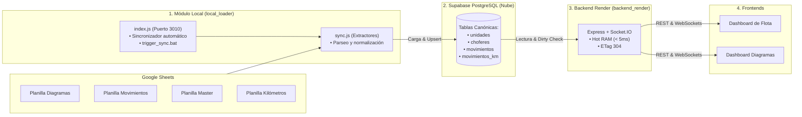

# 🚛 Storage RAM DB — Arquitectura Desacoplada (Local Loader + Backend Render)

El proyecto ha sido desacoplado en **dos módulos independientes y especializados** para optimizar el rendimiento, evitar el consumo excesivo de memoria/cuotas en la nube y garantizar alta disponibilidad:

---

## 🗂️ Módulos del Sistema

```text
storage_ram_db/
├── 📥 local_loader/        # Módulo de Extracción y Carga a Supabase (Entorno Local)
│   ├── Puerto: 3010 (Dedicado y libre)
│   ├── Lee: Google Sheets (Diagramas, Movimientos, Master, KM)
│   ├── Escribe: Supabase PostgreSQL (unidades, choferes, movimientos, etc.)
│   └── Ver: local_loader/README.md
│
├── 🚀 backend_render/     # Backend API y Caché Reactiva en RAM (Para subir a Render)
│   ├── Puerto: Dinámico en Render (PORT) / 3005 local
│   ├── Lee: Exclusivamente Supabase PostgreSQL (Pool 6543)
│   ├── Sirve: Frontend (Diagramas, Dashboard de Flota, Pañol) vía REST y Socket.IO
│   └── Ver: backend_render/README.md
```

---

## 📐 Flujo General de Datos



---

## 📋 Resumen Rápido de Uso

### 📥 1. Entorno Local (`local_loader`)
Responsable de extraer de Google Sheets y escribir en Supabase.
- **Carpeta:** [`local_loader`](local_loader/)
- **Puerto:** `3010`
- **Comandos:**
  ```bash
  cd local_loader
  npm install
  npm start         # Inicia el daemon en puerto 3010 (sincroniza cada 15 min)
  npm run sync      # Ejecuta una sincronización inmediata a Supabase
  npm run sync:dry  # Prueba en modo simulación (sin escribir en la BD)
  ```
- **Documentación Completa:** Consulta [`local_loader/README.md`](local_loader/README.md).

---

### 🚀 2. Backend para Render (`backend_render`)
Servidor que se despliega en Render para entregar datos en tiempo real al frontend.
- **Carpeta:** [`backend_render`](backend_render/)
- **Puerto:** Asignado automáticamente por Render (`process.env.PORT`), localmente `3005`.
- **Despliegue en Render:**
  - Build Command: `npm install`
  - Start Command: `node server.js`
  - Root Directory: `backend_render` (o desplegar el contenido de la carpeta directamente)
- **Documentación Completa:** Consulta [`backend_render/README.md`](backend_render/README.md).
