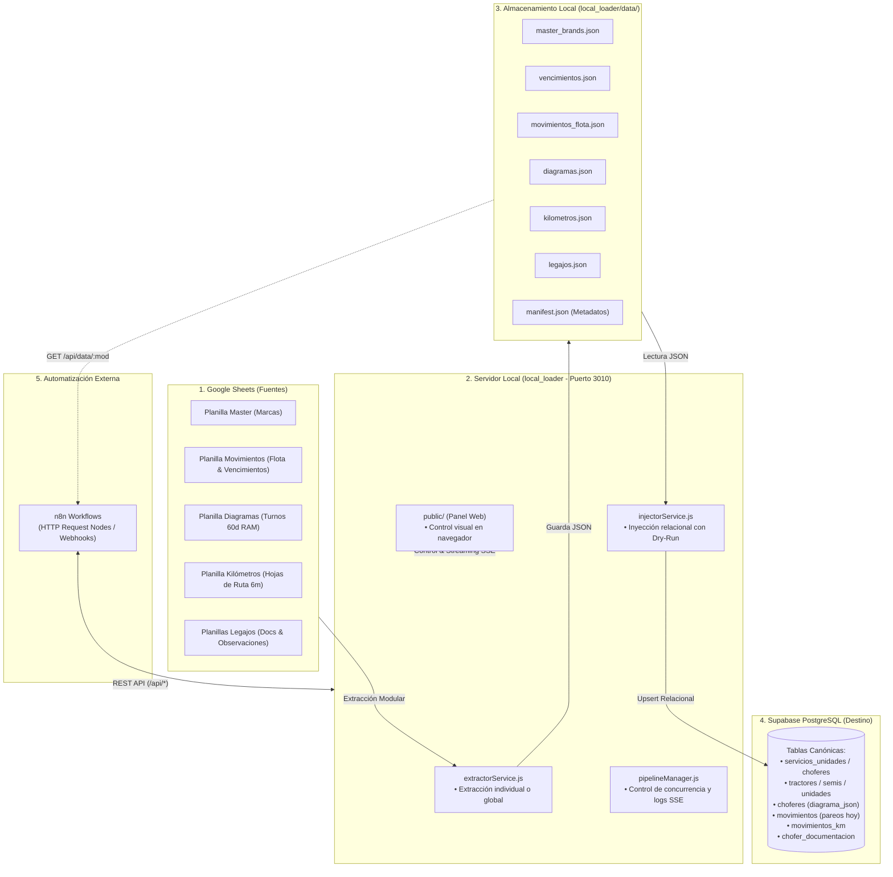

# 📥 Local Supabase Loader & ETL Hub — Arquitectura Modular y Panel de Control

Módulo local dedicado a la **extracción modular**, normalización, almacenamiento local en JSON e **inyección desacoplada** de datos desde **Google Sheets** hacia **Supabase PostgreSQL**.

Incluye:
- **Almacenamiento Local en JSON (`./data/*.json`)**: Cada extracción se guarda desacoplada de la base de datos para inspección, respaldos y consumo directo.
- **Ejecución Modular (Junto o Separado)**: Extrae e inyecta todo junto en un solo paso, o módulo por módulo de forma independiente.
- **Panel Web de Control (`http://localhost:3010/`)**: Interfaz visual moderna para disparar acciones, monitorear estado, ver logs en vivo vía SSE y explorar los datos extraídos.
- **API REST & Webhooks para n8n**: Endpoints listos para orquestar flujos automatizados con n8n.

---

## 📐 Flujo de Arquitectura Modular



---

## 🚀 Inicio Rápido

### 1. Iniciar con el Acceso Directo (Windows)
Doble clic en cualquiera de estos archivos:
- `start_control_panel.bat` (en la raíz de `storage_ram_db`)
- `local_loader/start_control_panel.bat`

El servidor se iniciará en el puerto `3010` y abrirá automáticamente tu navegador en **`http://localhost:3010`**.

### 2. Iniciar por Terminal
```bash
cd local_loader
npm start
```

---

## 🎛️ Modos de Ejecución: Separado vs. Junto

### A. Extracción a Local (Separada)
Descarga la planilla indicada desde Google Sheets, normaliza los datos y los guarda en `local_loader/data/<modulo>.json`. **No toca Supabase.**
- **Desde la UI:** Botón "Extraer a Local" en la tarjeta del módulo.
- **Vía API:** `POST /api/extract/:module` (`module`: `master`, `vencimientos`, `flota`, `diagramas`, `kilometros`, `legajos`, `all`).

### B. Inyección a Supabase (Separada)
Lee los datos del archivo JSON local correspondiente y ejecuta las cargas y upserts en Supabase.
- **Desde la UI:** Botón "Inyectar a Supabase" o "Simular (Dry-Run)".
- **Vía API:** `POST /api/inject/:module` (acepta `{ "dryRun": true }` en el body o `?dryRun=true`).

### C. Pipeline Completo (Junto)
Ejecuta la extracción a local seguida inmediatamente de la inyección en Supabase para el módulo o todos.
- **Desde la UI:** Botón principal "Sincronización Total" o los botones rápidos de la franja inferior.
- **Vía API:** `POST /api/sync/:module`.

---

## ⚡ Integración con n8n

El servidor expone una API REST pensada para ser consumida directamente por nodos **HTTP Request** de n8n:

| Método | Endpoint | Descripción | Body / Parámetros |
| :--- | :--- | :--- | :--- |
| `POST` | `/api/extract/:module` | Extrae planilla(s) a JSON local | `{"webhookUrl": "opcional"}` |
| `POST` | `/api/inject/:module` | Inyecta JSON local a Supabase | `{"dryRun": false}` |
| `POST` | `/api/sync/:module` | Extrae e inyecta en 1 paso | `{"dryRun": false, "webhookUrl": "..."}` |
| `GET` | `/api/data/:module` | Retorna los datos JSON limpios | Parámetros: `:module` |
| `GET` | `/api/status` | Retorna estado del servidor y metadatos | — |
| `GET` | `/api/logs` | Últimos logs del sistema | `?limit=50` |
| `GET` | `/api/events` | Stream Server-Sent Events (SSE) | — |

### Ejemplos cURL para n8n:

#### 1. Disparar sincronización de flota y avisar por webhook:
```bash
curl -X POST http://localhost:3010/api/sync/flota \
  -H "Content-Type: application/json" \
  -d '{"dryRun": false, "webhookUrl": "http://localhost:5678/webhook/etl-flota-done"}'
```

#### 2. Obtener datos extraídos de flota directamente en n8n:
```bash
curl http://localhost:3010/api/data/flota
```

#### 3. Simular inyección sin alterar Supabase:
```bash
curl -X POST http://localhost:3010/api/inject/all \
  -H "Content-Type: application/json" \
  -d '{"dryRun": true}'
```

---

## 📁 Estructura del Proyecto (`local_loader/`)

```text
local_loader/
├── services/
│   ├── storageHelper.js       # Persistencia de JSON en local_loader/data/ y manifest.json
│   ├── extractorService.js    # Lógica modular de lectura de Google Sheets
│   ├── injectorService.js     # Lógica modular de upsert en Supabase y modo Dry-Run
│   └── pipelineManager.js     # Gestor de estados, cola, logs en memoria, SSE y webhooks
├── public/
│   ├── index.html             # Interfaz web del Panel de Control
│   ├── styles.css             # Estilos modernos dark/light
│   └── app.js                 # Lógica interactiva del cliente y suscripción SSE
├── data/                      # 💾 Almacenamiento local de datos extraídos
│   ├── manifest.json          # Metadatos de sincronización por módulo
│   ├── master_brands.json     # Marcas canónicas
│   ├── vencimientos.json      # Catálogo de vencimientos
│   ├── movimientos_flota.json # Flota y pareos diarios
│   ├── diagramas.json         # Diagramas 60 días Hot RAM y meses
│   ├── kilometros.json        # Viajes e historial de 6 meses
│   └── legajos.json           # Documentación y observaciones
├── extractors/                # Motores de parseo específicos por planilla
├── server.js                  # Servidor Express (Puerto 3010)
├── start_control_panel.bat    # Lanzador 1-clic con apertura automática de navegador
└── .env                       # Variables de conexión (Google + Supabase)
```
